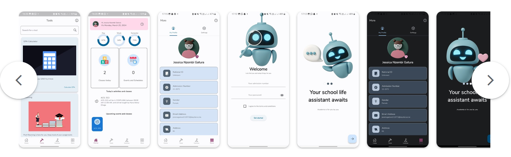

>This  will be archived soon see more information below about the fate of the project and why the archive
>For the impatient find the new Academia [here](https://github.com/opencrafts-io/academia)

# Academia

Academia is an open-source mobile application initially designed specifically for Daystar University students to navigate through school life.


## Features

- Chirp - Daystar's social platform
- Course Tracking
- Student transcripts and audits
- Flash Cards
- Ai Study with me
- Todos


## How to build it

Please ensure that you have [Flutter](https://flutter.dev) installed on your machine

Clone the project

```bash
  git clone https://github.com/IamMuuo/academia.git
```

Go to the project directory

```bash
  cd academia
```

Install dependencies

```bash
  flutter pub get
```

Run the application

```bash
  flutter run
```


## Documentation
The application's code is heavily commented where necessary. 
Although in case of any queries or concerns feel free to open up an issue or mail us. See the support section below for more information

## Authors

- [@Erick](https://www.github.com/iammuuo)

## Screenshots




## Contributing

Contributions are always welcome!

See `contributing.md` for ways to get started.

Please adhere to this project's `code of conduct`.


## Support

For support, you can open a github issue or mail info@opencrafts.io

We would really appreciate if you reported bugs or even made features for you and your fellow students to use and enjoy!

## License

[MIT](https://choosealicense.com/licenses/mit/)

## Why This Project Is Being Archived

After much consideration, we have decided to archive this repository and focus our efforts on a new, improved version of Academia hosted at [opencrafts-io/academia](https://github.com/opencrafts-io/academia). Here are the main reasons behind this decision:

1. **Broader Reach:**  
   This original app was designed specifically for Daystar University, Kenya. Our new platform aims to be truly global and usable by students from universities all over the world.

2. **Legal and Organizational Support:**  
   We are now an official open-source entity under Open Crafts Interactive (opencrafts.io), which provides a stronger legal and organizational foundation to support the project’s growth.

3. **Improved Architecture and Features:**  
   The current app’s architecture limits the addition of many exciting new features we have planned. The new codebase is designed to be more scalable, maintainable, and flexible to accommodate future innovations.

4. **Better Student Experience:**  
   We hope the new app will offer a more enjoyable, engaging, and useful experience for students everywhere.

5. **Easier Project Management:**  
   Managing the project under a dedicated organization allows for better control, collaboration, and long-term sustainability.

We encourage all contributors and users to join us in the new repository where the future of Academia is being built. Thank you for your support and contributions to this project!

---

